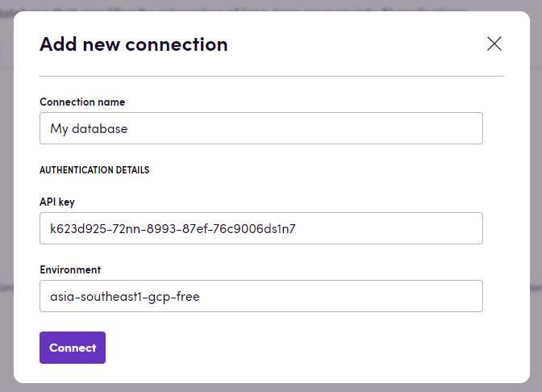
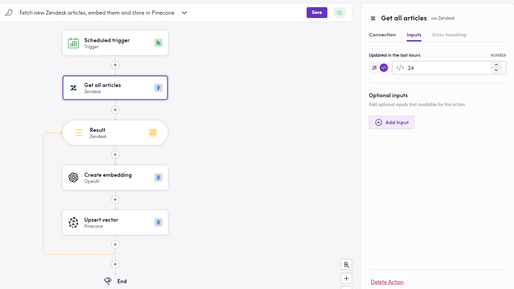

# Blackbird.io Pinecone

Blackbird is the new automation backbone for the language technology industry. Blackbird provides enterprise-scale automation and orchestration with a simple no-code/low-code platform. Blackbird enables ambitious organizations to identify, vet and automate as many processes as possible. Not just localization workflows, but any business and IT process. This repository represents an application that is deployable on Blackbird and usable inside the workflow editor.

## Introduction

<!-- begin docs --> 

Pinecone is a cloud-native vector database designed for high-performance AI applications, offering a managed solution with no infrastructure complexities. It specializes in storing and quickly querying vector embeddings, which serve as long-term memory for applications involving large language models, generative AI, and semantic search. The system ensures fast and accurate queries at scale, with low-latency results reflecting real-time updates and offering customization options for enhanced performance.

## Before setting up

Before you can connect you need to make sure that: 

- You have a Pinecone account.
- You have [created a project](https://docs.pinecone.io/docs/create-project).
- You have obtained an _API key_ and _Environment_ connection parameters. To find them, open the [Pinecone console](https://app.pinecone.io/), select the project you are interested in, and click on _API Keys_. Here, you can copy your _Environment_ and _API key_ values.

## Connecting

1. Navigate to apps and search for Pinecone. If you cannot find Pinecone then click _Add App_ in the top right corner, select Pinecone and add the app to your Blackbird environment.
2. Click _Add Connection_.
3. Name your connection for future reference e.g. 'My database'.
4. Fill in the _API key_ and _Environment_ obtained earlier.
5. Click _Connect_.
6. Confirm that the connection has appeared and the status is _Connected_.

## Actions

### Indexes

- **List indexes**.
- **Create index**. You can read about indexes and their parameters [here](https://docs.pinecone.io/docs/indexes). This action also accepts _Source collection_ parameter which is a static copy of an index. You can read more about collections [here](https://docs.pinecone.io/docs/collections).
- **Describe index** returns a description of an index.
- **Configure index** updates the pod type and/or number of replicas for an index. You can only increase the pod size or the number of replicas.
- **Delete index**.
- **List collections**.
- **Create collection** creates a collection from an index.
- **Describe collection** returns a description of a collection.
- **Delete collection**.

### Vectors

- **Query** retrieves the records in the index that are most similar to a given query vector.
- **Fetch vector** retrieves a vector by its ID.
- **Upsert vector** writes a new vector into the index.
- **Delete vector**.
- **Delete all vectors in namespace**.

## Example

In this example, a bird fetches Zendesk articles added in the past 24 hours, creates an embedding for each of them, and stores them in Pinecone.

## Feedback

Do you want to use this app or do you have feedback on our implementation? Reach out to us using the [established channels](https://www.blackbird.io/) or create an issue.

<!-- end docs -->
